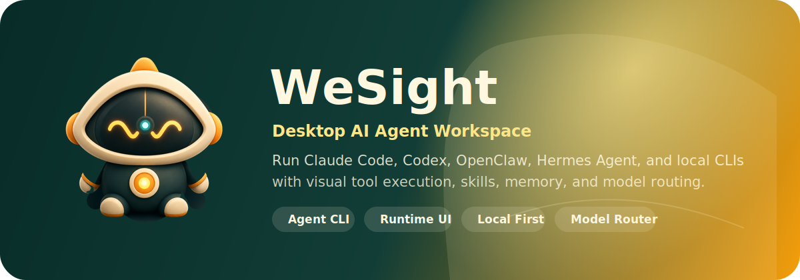
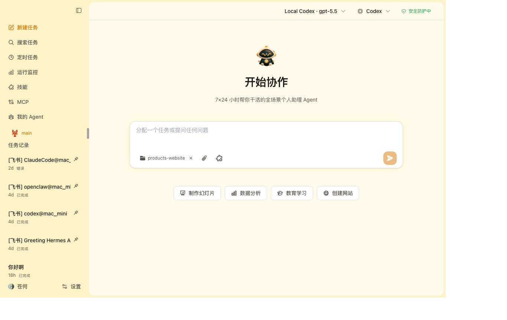
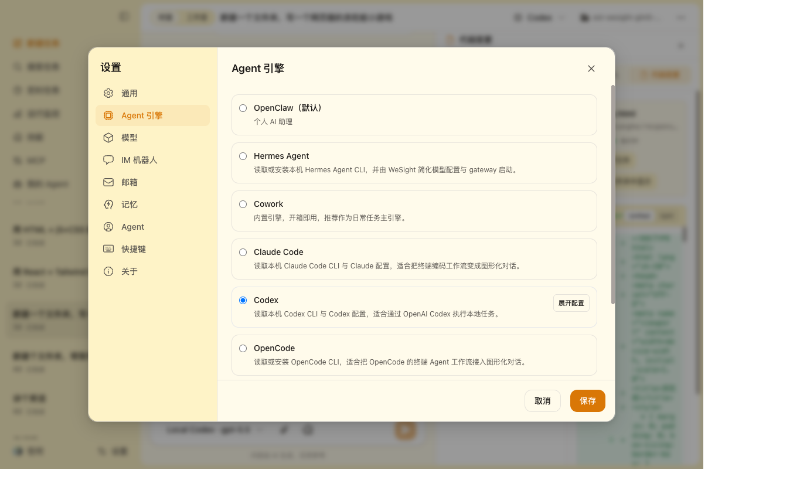
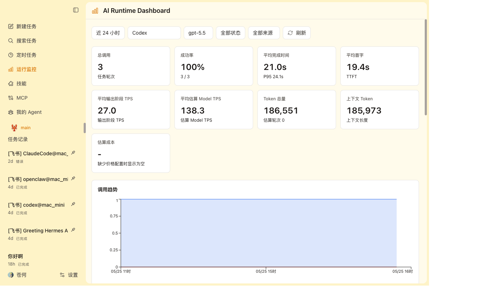
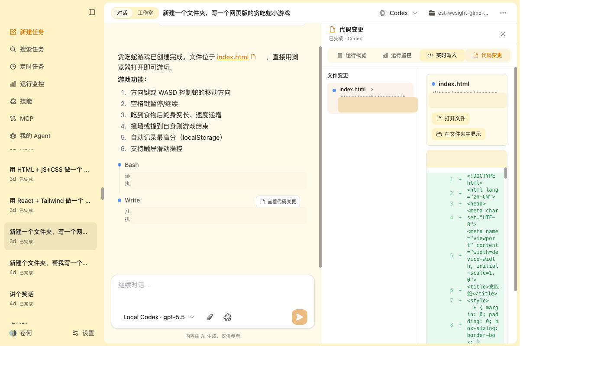
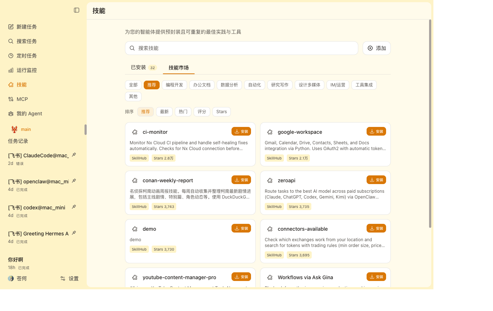
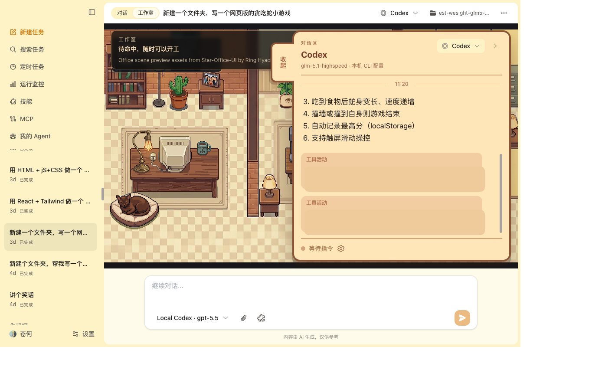

# Agora

<p align="center">
  
</p>

<h3 align="center">
  桌面 AI Agent 工作台
</h3>

<p align="center">
  <a href="https://github.com/SonicBotMan/agora/stargazers"></a>
  <a href="https://github.com/SonicBotMan/agora/network/members"></a>
  <a href="https://github.com/SonicBotMan/agora/releases/latest"></a>
  <a href="LICENSE"></a>
  
</p>

<p align="center">
  <a href="README.md">English</a> | <strong>简体中文</strong>
</p>

Agora 是一款开源的桌面 AI Agent 工作台，基于 Electron、React 和 TypeScript 构建。它提供了统一的图形界面，用于安装、配置和运行多种本地 Agent 引擎——包括 Claude Code（默认引擎）、OpenCode、OpenClaw、Hermes、DeepSeek-TUI 和 Codex。Agora 将这些引擎与聊天、工具、文件、IM 平台、模型供应商和运行监控整合到一款桌面应用中。

> 如果 Agora 对你的 Agent 工作流有帮助，欢迎点亮 Star，让更多开发者发现这个项目。

---

## 为什么选择 Agora

终端原生编码 Agent 虽然强大，但它们的安装、模型路由、权限管理、IM 入口、文件变更和运行指标往往分散在不同的地方。Agora 将这些环节整合到一个统一的桌面工作台中：

- **统一引擎中心** —— 在一个界面中安装、检测和切换多个本地 Agent CLI。
- **可视化对话界面** —— 通过丰富的聊天界面运行 Agent，支持工具面板、斜杠命令、文件 diff 和权限提示。
- **IM 集成** —— 将 Agent 任务接入飞书、钉钉、Telegram、Discord、微信、企业微信和 QQ。
- **运行时可观测性** —— 追踪每次任务的引擎、模型、Token 用量、首 token 延迟（TTFT）、每秒 token 数（TPS）、工具耗时、步骤、状态和耗时。
- **可扩展** —— 通过 SkillHub 技能市场、内置技能、定时任务和跨会话记忆扩展工作流。

---

## 核心功能

| # | 功能 | 描述 |
|---|------|------|
| 1 | **Agent 引擎中心** | 统一运行 Claude Code（默认）、OpenCode、OpenClaw、Hermes、DeepSeek-TUI 和 Codex，支持一键安装或复用本机 CLI 配置。 |
| 2 | **统一模型供应商** | 配置 OpenAI、Anthropic Claude、Google Gemini、DeepSeek、Qwen、Moonshot、Ollama、OpenRouter、GitHub Copilot 和自定义 OpenAI-compatible 接口。 |
| 3 | **IM Agent Hub** | 将飞书、钉钉、Telegram、Discord、微信、企业微信和 QQ 的消息接入任意引擎，支持按平台配置机器人。 |
| 4 | **AI Runtime Dashboard** | 按引擎、模型、来源、状态、Token、总耗时、TTFT、输出阶段 TPS、估算 Model TPS、工具耗时和 Agent 步数统计调用。 |
| 5 | **SkillHub 技能市场** | 发现、安装、启用、禁用、更新和删除技能，全部在集成的市场中完成。 |
| 6 | **定时任务与记忆** | 创建研究报告、监控、邮件整理、提醒等重复任务，自动提取对话记忆并跨会话延续上下文。 |

### 规划中的功能

| 功能 | 描述 |
|------|------|
| 🔬 **Deep Research** | 自主多源研究 Agent，支持引用追踪和报告生成。 |
| 🧩 **Agent Orchestration** | 多 Agent 协同编排，支持任务委派和交接，处理复杂工作流。 |
| 📚 **知识库** | 持久化向量存储，支持文档、代码库和项目上下文检索。 |
| 🔥 **热点话题** | 实时趋势发现，自动汇总社区热点内容。 |
| ⚙️ **技能中心** | 专门用于创建、测试和发布自定义 Agent 技能的工坊。 |
| 🖥️ **前端工作站** | 可视化组件沙盒，用于 AI 生成的 UI 预览和迭代调试。 |

---

## 产品截图

<table>
  <tr>
    <td width="50%">
      
    </td>
    <td width="50%">
      
    </td>
  </tr>
  <tr>
    <td><strong>Cowork 对话</strong><br>把本地编码 Agent 变成桌面 Chat，支持引擎和模型切换。</td>
    <td><strong>Agent 引擎</strong><br>配置 OpenCode、OpenClaw、Claude Code、Hermes、DeepSeek-TUI 和 Codex。</td>
  </tr>
  <tr>
    <td width="50%">
      
    </td>
    <td width="50%">
      
    </td>
  </tr>
  <tr>
    <td><strong>AI Runtime Dashboard</strong><br>查看引擎、模型、Token、TTFT、输出阶段 TPS、估算 Model TPS、成本和状态。</td>
    <td><strong>实时工作区</strong><br>在 Agent 工作过程中查看文件写入、代码变更、工具活动和产出文件。</td>
  </tr>
  <tr>
    <td width="50%">
      
    </td>
    <td width="50%">
      
    </td>
  </tr>
  <tr>
    <td><strong>技能市场</strong><br>按 SkillHub 分类浏览技能，下载安装到本地 Agora 技能目录。</td>
    <td><strong>工作室</strong><br>可视化工作区，观察 Agent 活动和任务进度。</td>
  </tr>
</table>

---

## Agent 引擎

| 引擎 | 适合场景 | 准备方式 |
|------|----------|----------|
| **OpenCode** | 默认终端 Agent 工作流 | 一键安装或复用本机 CLI 配置 |
| **OpenClaw** | 本地 Agent runtime，支持网关和 IM 能力 | 一键安装或复用本机 CLI 配置 |
| **Claude Code** | Claude Code 编码工作流的图形化使用 | 一键安装或复用本机 CLI 配置 |
| **Hermes** | Nous Research Hermes Agent runtime 和网关 | 一键安装或复用本机 CLI 配置 |
| **DeepSeek-TUI** | DeepSeek HTTP/SSE runtime 和工具流式渲染 | 一键安装或复用本机 CLI 配置 |
| **Codex** | Codex CLI 工作流、本地任务执行和 IM 控制 | 一键安装或复用本机 CLI 配置 |

## IM 平台

Agora 通过以下 IM 平台路由 Agent 任务，支持按平台配置机器人：

| 平台 | 集成方式 |
|------|----------|
| 飞书 | 原生网关 |
| 钉钉 | 原生网关 |
| Telegram | 原生网关 |
| Discord | 原生网关 |
| 企业微信 | 原生网关 |
| 微信 | 原生网关 |
| QQ | 原生网关 |

## 模型供应商

Agora 把模型配置集中在一个设置页。当某个引擎选择"跟随 Agora 模型设置"时，Agora 会把模型配置映射到该引擎。

- 添加多个供应商和多个模型。
- 使用官方 OpenAI、Anthropic Claude 和 Google Gemini 供应商。
- 为 DeepSeek、Qwen、Moonshot、Ollama、OpenRouter、GitHub Copilot、本地网关或私有 endpoint 添加 OpenAI-compatible 配置。
- 在 Agora 托管模型配置和本地 CLI 配置之间切换。
- 在需要统一管理时导入或同步本地引擎配置。

---

## 快速开始

### 环境要求

- **Node.js** `>=24`
- **npm**（或 `pnpm` / `yarn`）

### 本地开发

```bash
git clone https://github.com/SonicBotMan/agora.git
cd agora
npm install
npm run electron:dev
```

开发服务器默认运行在 `http://localhost:5175`。

### 带 Agent runtime 启动

```bash
# 启动 Agora，自动检测支持的本地 Agent CLI
npm run electron:dev

# 便捷别名，指向相同开发入口
npm run electron:dev:openclaw
npm run electron:dev:hermes
```

常用 OpenClaw 开发变量：

```bash
# 指定 OpenClaw 源码路径
OPENCLAW_SRC=/path/to/openclaw npm run electron:dev:openclaw

# 强制重建 OpenClaw runtime
OPENCLAW_FORCE_BUILD=1 npm run electron:dev:openclaw

# 本地开发 OpenClaw 时跳过版本切换
OPENCLAW_SKIP_ENSURE=1 npm run electron:dev:openclaw
```

### 构建

```bash
# TypeScript + Vite
npm run build

# Electron main process
npm run compile:electron

# Lint
npm run lint
```

### 打包分发

```bash
# macOS
npm run dist:mac
npm run dist:mac:x64
npm run dist:mac:arm64
npm run dist:mac:universal

# Windows
npm run dist:win

# Linux
npm run dist:linux
```

托管 runtime 元信息在 `package.json` 中声明。生成的 runtime 目录、构建产物、本地密钥和打包输出已加入 Git 忽略。

---

## 项目结构

Agora 使用 Electron 进程隔离架构。Renderer 不直接访问 Node.js API，高权限操作通过 preload bridge 和 main process IPC 完成。

```
src/
├── main/                        # Electron 主进程
│   ├── main.ts                  # 入口、IPC 处理器、窗口生命周期
│   ├── preload.ts               # 通过 contextBridge 的安全桥接
│   ├── sqliteStore.ts           # 本地持久化（设置、会话等）
│   ├── coworkStore.ts           # Cowork 会话和消息存储
│   ├── skillManager.ts          # 技能加载和管理
│   ├── im/                      # IM 网关集成
│   │   ├── feishu/              # 飞书网关
│   │   ├── dingtalk/            # 钉钉网关
│   │   ├── telegram/            # Telegram 网关
│   │   ├── discord/             # Discord 网关
│   │   ├── wecom/               # 企业微信网关
│   │   ├── wechat/              # 微信网关
│   │   └── qq/                  # QQ 网关
│   └── libs/
│       ├── agentEngine/         # 引擎适配器和路由
│       │   ├── coworkEngineRouter.ts   # 路由到内置或外部引擎
│       │   ├── claudeRuntimeAdapter.ts # 内置 Claude Agent SDK 适配器
│       │   └── openclawRuntimeAdapter.ts # OpenClaw 网关适配器
│       ├── coworkRunner.ts      # Agent 执行引擎
│       ├── coworkMemoryExtractor.ts # 对话记忆提取
│       └── openclawEngineManager.ts  # OpenClaw 运行时生命周期管理
│
├── renderer/                    # React 前端（渲染进程）
│   ├── App.tsx                  # 应用外壳
│   ├── components/
│   │   ├── cowork/              # 聊天、工作室、活动工作区、引擎 UI
│   │   ├── Settings.tsx         # 模型、引擎、IM、技能、记忆和应用设置
│   │   └── pet/                 # 桌面宠物 UI
│   ├── services/                # IPC 封装和应用服务
│   └── store/slices/            # Redux 状态管理
│
├── shared/                      # 共享常量和类型
│
SKILLs/                          # 内置技能
scripts/                         # runtime、打包和安装脚本
```

### 内置技能

| 方向 | 示例 |
|------|------|
| 研究 | Web 搜索、科技新闻、股票研究、影视/音乐搜索 |
| 文档 | DOCX、XLSX、PPTX、PDF 处理 |
| 自动化 | Playwright、本地工具、定时任务 |
| 创作 | Remotion 视频、前端设计、Canvas 设计、图片与视频工作流 |
| 通信 | IMAP/SMTP 邮件和 IM 通道 |
| Agent 构建 | Skill 创建、Skill 审查、自定义规划 |

技能可以在桌面 UI 中安装、启用、停用、删除和路由。

---

## 安全设计

- **Renderer 开启 context isolation**。
- **Renderer 禁用 Node integration**。
- 敏感操作统一经过 main process IPC。
- 工具执行过程可展示权限确认事件。
- 本地数据存储在应用数据目录中的 SQLite。
- runtime、构建产物、生成资产和本地密钥文件已加入 Git 忽略。

---

## 贡献指南

欢迎各种形式的贡献！无论是 Bug 修复、新功能、文档改进还是社区支持，每一份贡献都很有价值。

1. **Fork** 本仓库。
2. **创建功能分支**：`git checkout -b feat/my-feature`。
3. **提交你的更改**：`git commit -m 'feat: add some feature'`。
4. **推送到分支**：`git push origin feat/my-feature`。
5. **创建 Pull Request**。

请确保你的代码通过 lint 检查（`npm run lint`），并遵循现有的代码风格。

### 开发规范

- 使用约定式提交信息（`feat:`、`fix:`、`docs:`、`refactor:` 等）。
- 保持 renderer 不直接依赖 Node.js API —— 使用 IPC 桥接。
- 新功能请添加相应测试（运行 `npm run test:memory`）。

---

## 致谢

Agora 的设计与工程实现受到了许多优秀开源项目和 Agent 社区实践的启发：

- [OpenCode](https://github.com/opencode-ai/opencode) —— 开创性的终端 Agent 工作流，作为默认引擎的参考实现。
- [OpenClaw](https://github.com/openclaw/openclaw) —— 本地 Agent runtime、网关和 IM Agent 能力的探索。
- [Hermes Agent](https://github.com/NousResearch/hermes-agent) —— 本地 Agent runtime、gateway 和模型配置方式的参考。
- [Claude Code](https://docs.anthropic.com/en/docs/claude-code/) —— 终端 Agent 工作流的灵感来源。
- [Codex](https://github.com/openai/codex) —— 用于本地任务执行的 CLI Agent。
- [DeepSeek-TUI](https://github.com/deepseek-ai/deepseek-tui) —— DeepSeek 模型的终端 UI。
- [SkillHub](https://skillhub.lol/skills) —— 技能发现、安装和技能市场体验的启发。
- 以及所有推动本地 AI Agent 工作流发展的开源作者和社区成员。

---

## 开源协议

MIT。详见 [LICENSE](LICENSE)。
